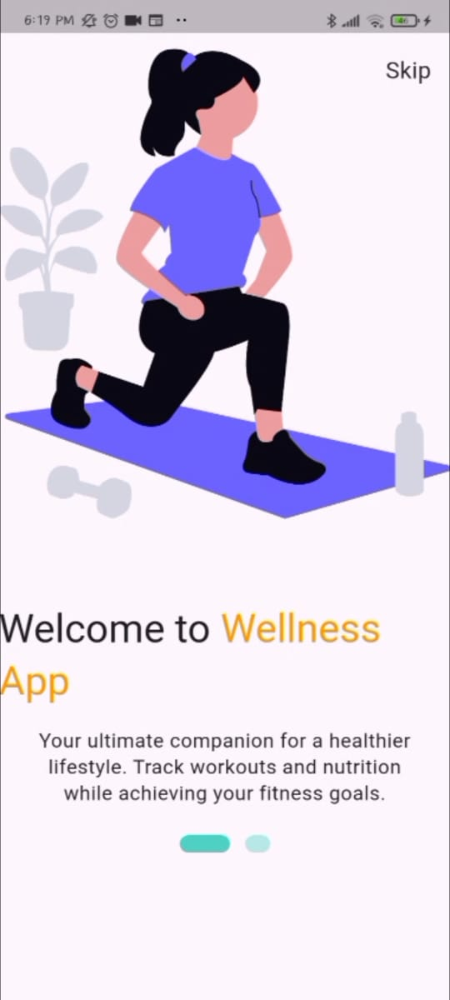
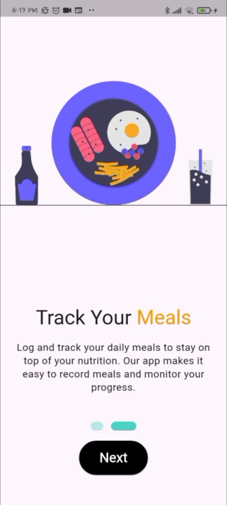
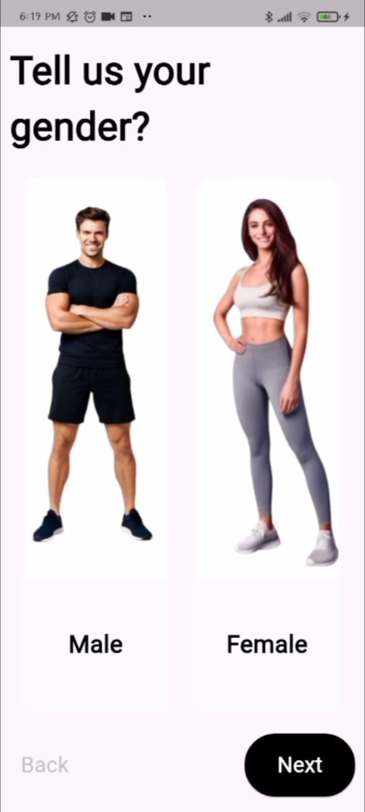
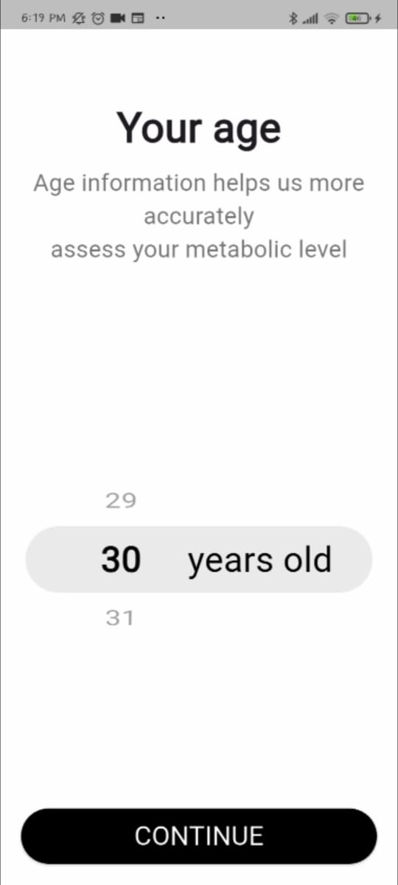
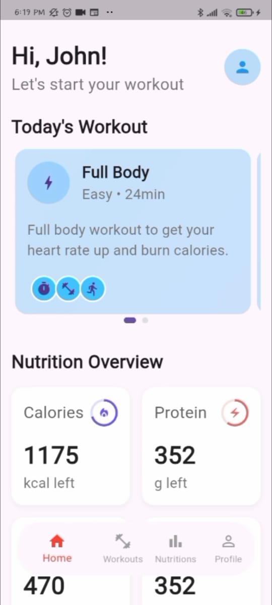
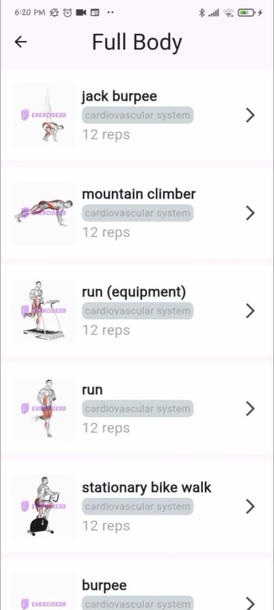
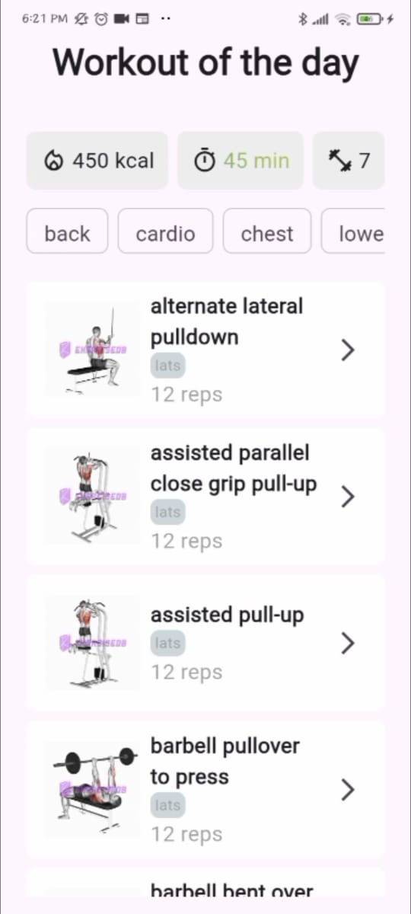
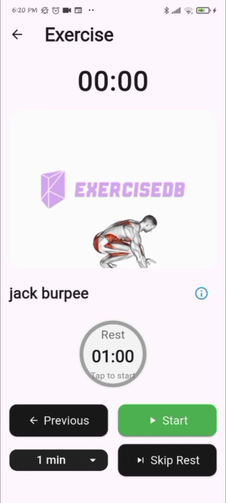
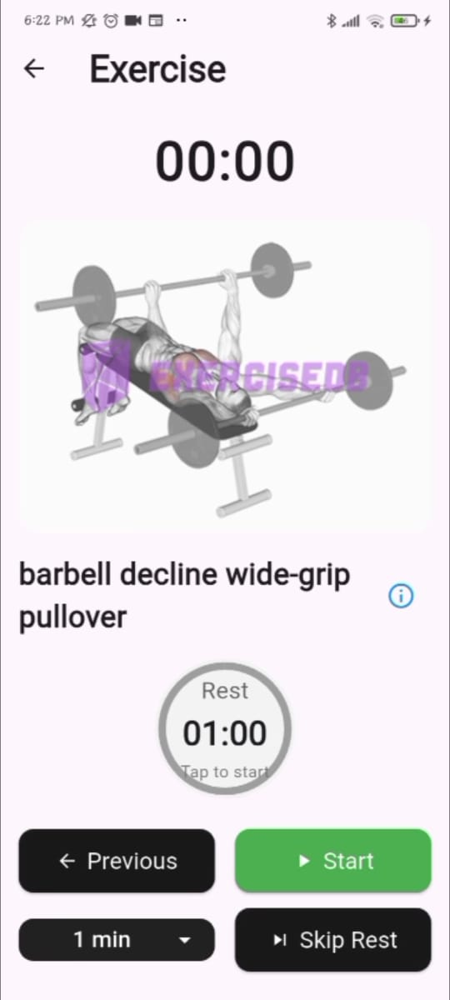
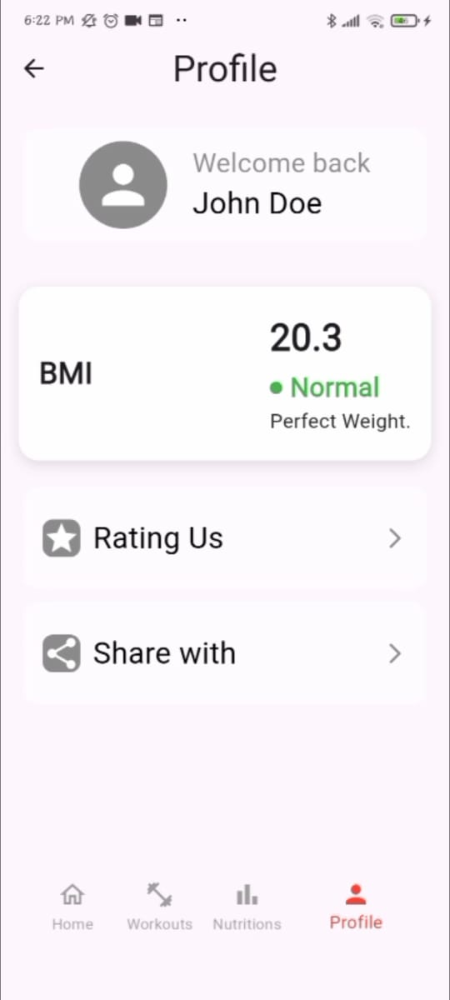

# 💪 Wellness App

A Flutter fitness application designed to help users stay healthy and track their daily progress.  
The app provides structured workout plans, BMI tracking, and progress visualization — all powered by **Cubit state management** and **Wger API** integration using **Dio**.

---


## 🌟 Features

- **Onboarding:** Smooth introduction to app goals and features
- **Workout Plans:** Daily exercise routines inspired by *“Six Pack in 30 Days”*
- **Progress Tracking:** Visualize your progress throughout your fitness journey
- **BMI Calculator:** Calculate and display your Body Mass Index in the Profile section
- **API Integration:** Fetch workouts and exercises dynamically via **Wger Workout API**
- **Offline Caching:** Data loaded once and cached to prevent repeated API calls
- **Profile Screen:** View BMI, share app, and leave ratings
- **Modern UI:** Clean and motivating design with intuitive navigation
- **State Management:** Built with **BLoC** for scalable and maintainable architecture

---


## 📸 Screenshots

### **🛠 Onboarding Screens**
| Onboarding 1                                        | Onboarding 2                                        | 
|-----------------------------------------------------|-----------------------------------------------------|  
|  |  |

---

### **⚙️ User Questionnaire Screens**
| User Questionnaire 1                                                | User Questionnaire 2                                                | User Questionnaire 3                                                |
|---------------------------------------------------------------------|---------------------------------------------------------------------|---------------------------------------------------------------------|  
|  |  |  |  

---
### **⚙️ Main Home Screens**
| Main Home Screen                                       | 
|--------------------------------------------------------| 
|  | 

---

### **🏆 Full Body Screen**
| Full Body Screen                                           |  
|------------------------------------------------------------|  
|  |  

---

### **🏆 Workout Screen**
| Workout Screen                                           |  
|----------------------------------------------------------|  
|  | 

---

### **⚙️ Exercise Screens**
| Exercise 1                                           | Exercise 2                                           |
|------------------------------------------------------|------------------------------------------------------|  
|  |  |   

---

### **🏆 Nutrations Screen**
| Nutrations Screen                                             |  
|---------------------------------------------------------------|  
|  | 

---

### **🏆 Profile Screen**
| Profile Screen                                           |  
|----------------------------------------------------------|  
|  | 


## 🛠️ Tech Stack

- Framework: **Flutter**
- State Management: **BLoC**
- HTTP Client: **Dio**
- API: **Wger Workout API**
- Architecture: **Feature-based + Clean Architecture**
- Caching: **Local Storage** (API data cached for efficiency)

---  

## 🚀 Getting Started

### Prerequisites

- Flutter SDK (Version 3.0 or higher)
- Dart SDK (Version 2.17 or higher)
- Android Studio / VS Code
- Git

### Installation

1. Clone the repository
```bash
git clone https://github.com/AhmedHafez32/wellness
```
2. Navigate to project directory
```bash
cd wellness
```
3. Install dependencies
```bash
flutter pub get
```
4. Run the app
```bash
flutter run
```

---  

## 📁 Project Structure

```
lib/
├── core/
│   ├── common/
│   │   ├── services/
│   │   │   └── local_database/
│   │   │       └── shared_preference_database.dart
│   │   └── widgets/
│   │       ├── progress_bar.dart
│   │       ├── pull_to_reveal.dart
│   │       └── stacked_circular_matrix.dart
│   ├── gen/
│   │   └── assets_gendart/
│   ├── networking/
│   │   ├── wesper.api
│   │   ├── api_service.dart
│   │   ├── api_service.g.dart
│   │   ├── auth_intersector.dart
│   │   ├── dio_factory.dart
│   │   ├── token_manager.dart
│   │   └── api_constraints.dart
│   ├── routes/
│   │   ├── route_generator.dart
│   │   └── route_model.dart
│   ├── service_locator/
│   │   └── sl.dart
│   ├── ui/
│   │   ├── widgets/
│   │   │   ├── color_palette.dart
│   │   │   ├── text_styles.dart
│   │   │   └── theme.dart
│   │   └── common_animations.dart
│   ├── utils/
│   │   ├── helper/
│   │   │   └── extension.dart
│   │   └── types/
│   │       ├── networking_error_types.dart
│   │       └── result_type.dart
│   ├── biomarkers_model.dart
│   └── multilike_listener.dart
│
├── features/
│   ├── login/
│   │   ├── data/
│   │   │   ├── models/
│   │   │   │   ├── login_request_body.dart
│   │   │   │   └── login_response.dart
│   │   │   └── repo/
│   │   │       └── login_repo.dart
│   │   ├── logic/
│   │   │   └── cubit/
│   │   │       ├── login_cubit.dart
│   │   │       └── login_state.dart
│   │   └── presentation/
│   │       ├── screens/
│   │       │   └── login_screen.dart
│   │       └── widgets/
│   │           ├── dont_have_account_text.dart
│   │           ├── email_and_password.dart
│   │           └── login_cubit_listener.dart
│   │
│   ├── register/
│   │   ├── data/
│   │   │   ├── models/
│   │   │   │   ├── register_request_body.dart
│   │   │   │   └── register_response.dart
│   │   │   └── repo/
│   │   │       └── register_repo.dart
│   │   ├── logic/
│   │   │   └── cubit/
│   │   │       ├── register_cubit.dart
│   │   │       └── register_state.dart
│   │   └── presentation/
│   │       ├── screens/
│   │       │   └── register_screen.dart
│   │       └── widgets/
│   │           ├── already_have_account_text.dart
│   │           ├── sign_up_cubit_listener.dart
│   │           └── sign_up_form.dart
│   │
│   ├── nutrition/
│   │   ├── components/
│   │   │   ├── calories_left_info.dart
│   │   │   └── mealtiest.dart
│   │   ├── logic/
│   │   │   └── cubit/
│   │   │       ├── calories_cubit.dart
│   │   │       └── calories_state.dart
│   │   ├── models/
│   │   │   └── user_model.dart
│   │   └── presentation/
│   │       └── nutrition_screen.dart
│   │
│   ├── onboarding/
│   │   ├── data/
│   │   │   └── onboarding_content_model.dart
│   │   └── presentation/
│   │       ├── widgets/
│   │       │   ├── onboarding_page.dart
│   │       │   ├── onboarding_view_body.dart
│   │       │   └── visual_indicator.dart
│   │       └── onboarding_view.dart
│   │
│   ├── profile/
│   │   ├── data/
│   │   │   └── limit_category_model.dart
│   │   └── presentation/
│   │       └── widgets/
│   │           └── profile_screen.dart
│   │
│   ├── routine/
│   │   ├── data/
│   │   │   ├── models/
│   │   │   │   └── routine_response.dart
│   │   │   └── repo/
│   │   │       └── routine_repo.dart
│   │   └── logic/
│   │       └── cubit/
│   │           ├── routine_cubit.dart
│   │           └── routine_state.dart
│   │
│   ├── user_questionnaire/
│   │   ├── data/
│   │   │   ├── exercise_type_model.dart
│   │   │   ├── gender_type_model.dart
│   │   │   └── user_questionnaire_keys.dart
│   │   ├── logic/
│   │   │   └── exercise_questionnaire_model.dart
│   │   └── presentation/
│   │       └── components/
│   │           └── activity_level_listtile.dart
│   │
│   ├── workouts/
│   │   ├── data/
│   │   │   ├── models/
│   │   │   │   ├── exercise_model.dart
│   │   │   │   └── exercise_model.mapper.dart
│   │   │   ├── exercises_service.dart
│   │   │   └── exercise_repo.dart
│   │   ├── logic/
│   │   │   ├── bloc/
│   │   │   │   ├── exercises_bloc.dart
│   │   │   │   ├── exercises_event.dart
│   │   │   │   └── exercises_state.dart
│   │   │   └── workouts_viewmodel.dart
│   │   └── presentation/
│   │       ├── components/
│   │       │   ├── exercise_carouselview.dart
│   │       │   ├── exercises_by_type_listview.dart
│   │       │   └── floating_nav_bar.dart
│   │       ├── widgets/
│   │       │   ├── dashboard_screen.dart
│   │       │   ├── exercise_by_type.dart
│   │       │   ├── exercise_screen.dart
│   │       │   └── workouts_screen.dart
│   │       └── selection_screens/
│   │           ├── activity_level_selection_screen.dart
│   │           ├── app_selection_screen.dart
│   │           ├── exercise_type_selection_screen.dart
│   │           ├── favorites_meals_selection_screen.dart
│   │           ├── gender_type_selection_screen.dart
│   │           ├── goal_selection_screen.dart
│   │           ├── height_scale_selection_screen.dart
│   │           └── weight_scale_selection_screen.dart
│   │
│   └── shared_components/
│       ├── components/
│       │   ├── activity_level_listview.dart
│       │   ├── minimized_scale_widget.dart
│       │   ├── bottom_transition_btn.dart
│       │   ├── exercise_type_gridview.dart
│       │   ├── gender_type_listview.dart
│       │   └── goal_listview.dart
│       └── widgets/
│           ├── minimized_scale_widget.dart
│           ├── pill_shaped_btn.dart
│           ├── scale_dashed_painter.dart
│           ├── scale_value_unit.dart
│           └── unit_toggle_btn.dart
│
├── fitness_app.dart
└── main.dart

```

---  

## 🎯 Features in Detail

**Onboarding**
Introduces the app, its goals, and how users can track fitness progress.

**Workout Days**
Each day contains a list of exercises fetched from Wger API with detailed instructions.

**Progress Tracker**
Displays daily completion status and visual progress indicators.

**BMI Calculation**
Calculates BMI automatically based on the user’s data and displays results.

**Caching**
Once workouts are fetched, they’re stored locally to avoid repeated network calls.

---  

## 🔧 Configuration
```
Dependencies used in pubspec.yaml
dependencies:
  cupertino_icons: ^1.0.8
  dart_mappable: ^4.5.0
  dartz: ^0.10.1
  dio: ^5.8.0+1
  drift: ^2.26.0
  drift_flutter: ^0.2.4
  equatable: ^2.0.7
  flutter:
    sdk: flutter
  flutter_bloc: ^9.1.0
  flutter_gen_runner: ^5.10.0
  flutter_lints: ^5.0.0
  flutter_native_splash: ^2.4.6
  flutter_rating_bar: ^4.0.1
  flutter_screenutil: ^5.9.3
  flutter_secure_storage: ^9.2.4
  flutter_svg: ^2.1.0
  get_it: ^8.0.3
  google_fonts: ^6.2.1
  json_annotation: ^4.9.0
  logging: ^1.3.0
  percent_indicator: ^4.2.5
  pretty_dio_logger: ^1.4.0
  retrofit: ^4.4.2
  share_plus: ^11.0.0
  shared_preferences: ^2.5.3
  vector_graphics_compiler: 1.1.16
```
---  

## 👨‍💻 Author

**Ahmed Hafez**

- GitHub: [AhmedHafez32](https://github.com/AhmedHafez32)
- LinkedIn: [ahmedhafez47](https://www.linkedin.com/in/ahmedhafez47/)
